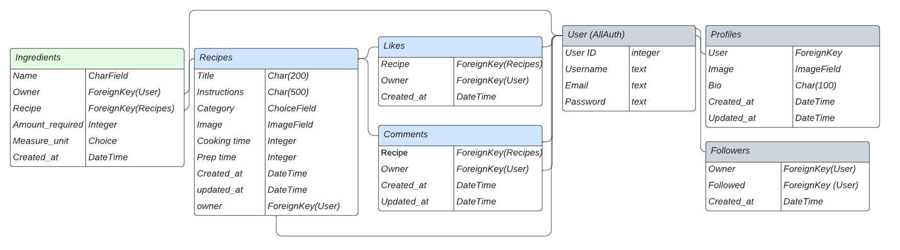

#Cheffies-API

Welcome,

In this document I will explain the reason and approach behind the Cheffies API app. Imagine this, you just finished working and craving some food. However, you didn't do your weekly groceries so you have to come up with some recipe on the spot. You won't be the only one that is lost for inspiration in such moments. Therefore, I created the app Cheffies, and this is the API backend for this project. You can get your daily recipe inspiration by following others, commenting to improve others, and create a mealplan by liking other recipes.

Cheffies-API is the backend for the Cheffies application which has the goal to be a socially interactive and inspirational platform for recipes.

The last update to this file was: **March, 2023**

# Deployed project
The app can be accessed via the following link: [Click to go to Website](https://cheffies-api.herokuapp.com/) 

## Repository

[Find the project repository here.](https://github.com/MerelMoehn/cheffies-api)

# Table of Contents

## Contents
- [General introduction and instructions](#general-introduction-and-instructions)
  * [Project Approach](#project-approach)
  * [Epics & labels](#epics-&-labels)
  * [Project Planning](#project-planning)
- [User stories](#user-stories)
- [Data Model](#the-data-model)
  * XXX
  * XXX
- [Technology Used](#technology-used)
  * [Languages used](#languages-used)
  * [Frameworks & Libraries used](#frameworks-and-libraries-used)
- [Testing](#testing)
  * [Manual Testing](#manual-testing)
  * [Automated Testing](#automated-testing)
  * [Bugs found and solved](#bugs-found-and-solved)
    * [Unsolved bugs](#unsolved-bugs)
- [Deployment](#deployment)
  * [Deployment steps](#deployment-steps)
  * [Creating a local clone](#creating-a-local-clone)
- [Credits](#credits)
  * [Code](#code)
    * [Code Institute](#code-institute)
  * [Acknowledgments](#acknowledgements)

# General introduction and instructions
## Project Approach
This application is built using an agile approach. Therefore, the functionalities were broken down into Epics & User stories, and these picked up in sprints. Each sprint consisted of two weeks. 

## Epics & labels
The application features were broken down into Epics and hence in User Stories. 
As the approach for each app was quite repetitive and only focus on the back-end, the Epics and User Stories have a somewhat basic setup. 

The following Epics were defined:
- Recipe Models: all work related to both the Recipe App and the Ingredient App.
- Social Models: all work related to the Follower, Like, and Comment App.
- User Models: all work related to the Profile App.

Additional labels used:
- Bug: to label the bugs found and solved during the project
- Documentation: to label all stories related to creating the correct and sufficient documentation.

## Project Planning
The project was planned and built in three sprints each consisting of two weeks. The project tool used was GitHub Projects & Issues. The issues were mapped on a kanban board using labels and swimming lanes.

[View stories/bugs included in sprint 1.](https://github.com/MerelMoehn/cheffies-api/milestone/1?closed=1)
[View stories/bugs included in sprint 2.](https://github.com/MerelMoehn/cheffies-api/milestone/2?closed=1)
[View stories/bugs included in sprint 3.](https://github.com/MerelMoehn/cheffies-api/milestone/3?closed=1)

# User stories
The user stories for the cheffies-API are repetitive. For each App we create a model, the URL pattern, the serializer, include it in the installed apps, etc. Therefore, the stories are not as extensive as they are in the Cheffies React (Front-end) repository. 

# Data model & CRUD breakdown
[Click here for related user story.](https://github.com/MerelMoehn/cheffies-api/issues/1)
The data model was created in LucidChart. 

## The Recipes Model
- owner = This is a ForeignKey to the User model. It creates a relation between a User and a Recipe.
- created_at = is an automatically added DateTime instance when the recipe is created.
- updated_at = is an automatically added DateTime instance when the recipe is updated.
- title = A CharField instance with the Title of the recipe.
- instructions = A TextField instance with the instructions to follow for each recipe.
- category = An option instance to state whether the recipe is a starter, main, desert or snack.
- cooking_time = An integer instance to show how much cooking time is required for this recipe.
- prep_time = An integer instance to show how much preporation time is required for this recipe.
- image = An image field instance that allows the user to upload an image. Otherwise a default image is shown.

## The Ingredients Model
- owner = This is a ForeignKey to the User model. It creates a relation between a User and a Ingredient.
- created_at = is an automatically added DateTime instance when the recipe is created.
- recipe = This is a ForeignKey to the Recipe model. It creates a relation between a Recipe and a Ingredient.
- title = A CharField instance with the Name of the Ingredient.
- amount_required = An integer instance to show how much is required of each ingredient.
- measure_unit = An option instance to indicate which unit is required for the ingredient. Options are cup(s), gram, tablespoon(s), item, ml, L, kg, ounce.

## The Profiles Model
- owner = This is a ForeignKey to the User model. It creates a relation between a User and a Profile.
- created_at = is an automatically added DateTime instance when the Profile is created.
- updated_at = is an automatically added DateTime instance when the Profile is updated.
- bio = is a textfield in which a user can give a short description about him/herself.
- image = is an ImageField (including a default) so that an user can upload his/her own picture.

## The Comments Model
- recipe = This is a ForeignKey to the Recipe model. It creates a relation between a Recipe and a Comment.
- content = This is a textfield with the comment text.
- owner = This is a ForeignKey to the User model. It creates a relation between a User and a Comment.
- created_at = is an automatically added DateTime instance when the Comment is created.
- updated_at = is an automatically added DateTime instance when the Comment is updated.

## The Likes Model
- recipe = This is a ForeignKey to the Recipe model. It creates a relation between a Recipe and a Like.
- owner = This is a ForeignKey to the User model. It creates a relation between a User and a Like.
- created_at = is an automatically added DateTime instance when the Like is created.

## The Followers Model
- owner = An owner is a User instance that follows another user. This is a ForeignKey to the User model. It creates a relation between a User and a Follower.
- created_at = is an automatically added DateTime instance when the Follower is created.
- followed = is the User that is followed by the owner (another user). This is a ForeignKey to the User model.

## CRUD breakdown
| model     | endpoints                    | create        | retrieve | update | delete | filter                   | text search |
| --------- | ---------------------------- | ------------- | -------- | ------ | ------ | ------------------------ | ----------- |
| recipes     | recipes/ recipes/:id/         | yes           | yes      | yes    | yes    | profile liked feed | title       |
| ingredients     | ingredients/ ingredients/:id/         | yes           | yes      | yes    | yes    | profile liked feed | name       |
| users     | users/ users/:id/         | yes           | yes      | yes    | no     | no                       | no          |
| profiles  | profiles/ profiles/:id/   | yes (signals) | yes      | yes    | no     | following followed    | name        |
| likes     | likes/ likes/:id/         | yes           | yes      | no     | yes    | no                       | no          |
| comments  | comments/ comments/:id/   | yes           | yes      | yes    | yes    | recipe                     | no          |
| followers | followers/ followers/:id/ | yes           | yes      | no     | yes    | no                       | no          |

# Technology used
## Languages used
- [HTML5](https://en.wikipedia.org/wiki/HTML5)
- [Python](https://en.wikipedia.org/wiki/Python_(programming_language))

## Frameworks & Libraries used
- [Django](https://www.djangoproject.com/)
  - This website is built using Django, a high-level Python web framework. I have also used Django to provide an admin view, create forms and test my website. Further features used include 
  - [Django Allauth](https://django-allauth.readthedocs.io/en/latest/index.html) I used Allauth for user authentification. 

# Testing
Manual tests that have been done:

## Automated testing
In total there are 16 automated tests built to test the views of each app.

## Bugs found and solved
Throughout the project there were multiple bugs found and solved. These bugs were logged on the GitHub project and can be reviewed via the following link: [Click here to review the bugs.](https://github.com/MerelMoehn/cheffies-api/labels/bug) 

### Unsolved bugs
At the moment of submitting and deployment, there were XXX

# Deployment
## Deployment steps
- set the following environment variables:
    - CLIENT_ORIGIN
    - CLOUDINARY_URL
    - DATABASE_URL
    - DISABLE_COLLECTSTATIC
    - SECRET_KEY
- installed the following libraries to handle database connection:
    - psycopg2
	- dj-database-url
- configured dj-rest-auth library for JWTs
- set allowed hosts
- configured CORS:
	- set allowed_origins
- set default renderer to JSON
- added Procfile with release and web commands
- gitignored the env&#46;py file
- generated requirements.txt
- deployed to Heroku

## Creating a local clone
You can create a local clone of the repository via the following steps:
1. navigate to the main page of the repository
2. download the code
3. Copy the URL for the repository.
4. Open Terminal
5. Change the current working directory to the location where you want the cloned directory.
6. Type git clone, and then paste the URL you copied earlier.
7. Press Enter to create your local clone.

For more detailed instructions, navigate to the following page:
https://docs.github.com/en/repositories/creating-and-managing-repositories/cloning-a-repository

# Credits
## Code
### Code Institute:
  - I based the set up of this project on the Code Institute DRF walkthrough projects. I have customised my API wherever possible.

## Acknowledgements
- Thank you to my mentor for helpful feedback, industry insights and recommended tools.

- Thank you to the tutors and staff at Code Institute for their support.

Thank you!